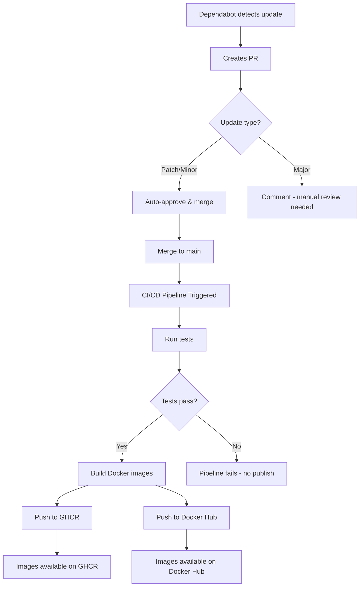

# GitHub Secrets Configuration Guide

This repository requires the following GitHub secrets to be configured for automated Docker Hub publishing and Dependabot auto-merge functionality.

## Required Secrets

### Docker Hub Publishing

To enable automated Docker image publishing to Docker Hub, configure these secrets in your repository settings:

1. **`DOCKER_USERNAME`**
   - **Description**: Your Docker Hub username
   - **Value**: `mup1987`
   - **Location**: Repository Settings → Secrets and variables → Actions → New repository secret

2. **`DOCKER_PASSWORD`**
   - **Description**: Docker Hub access token or password
   - **Recommendation**: Use a Docker Hub access token instead of your password for better security
   - **How to create**: 
     - Go to https://hub.docker.com/settings/security
     - Click "New Access Token"
     - Name it (e.g., "GitHub Actions")
     - Copy the token
     - Add it as the secret value
   - **Location**: Repository Settings → Secrets and variables → Actions → New repository secret

## Automated Workflows

### 1. Dependabot Auto-Merge (`.github/workflows/dependabot-auto-merge.yml`)

**Triggers**: When Dependabot creates a pull request

**Behavior**:
- ✅ **Auto-approves and merges** patch and minor version updates (e.g., 1.0.0 → 1.0.1 or 1.0.0 → 1.1.0)
- ⚠️ **Comments but doesn't merge** major version updates (e.g., 1.0.0 → 2.0.0) - requires manual review
- 🔄 **Triggers CI pipeline** which runs tests, builds, and publishes Docker images

**What happens after auto-merge**:
1. Dependabot creates PR with dependency update
2. Auto-merge workflow approves and merges if it's a patch/minor update
3. Main CI/CD pipeline triggers on merge to `main`
4. Docker images are built and pushed to both registries

### 2. CI/CD Pipeline (`.github/workflows/ci.yml`)

**Triggers**: 
- Push to `main` or `develop` branches
- Pull requests to `main`
- Manual workflow dispatch

**Docker Publishing Behavior**:

| Branch | GHCR (ghcr.io) | Docker Hub | Tags |
|--------|----------------|------------|------|
| `main` | ✅ Push | ✅ Push | `latest`, `main-<sha>`, version tags |
| `develop` | ❌ No push | ❌ No push | Build and test only |
| PR | ❌ No push | ❌ No push | Build and test only |

**Build Targets**:
- **GitHub Container Registry**: `ghcr.io/muah1987/ollama-mcp-server/mcp-ollama-server`
- **Docker Hub**: `docker.io/mup1987/ollama-mcp-server`

## Setup Instructions

### Step 1: Configure Docker Hub Secrets

```bash
# Go to your repository on GitHub
https://github.com/muah1987/Ollama-MCP-Server/settings/secrets/actions

# Click "New repository secret" and add:
# Name: DOCKER_USERNAME
# Value: mup1987

# Click "New repository secret" again and add:
# Name: DOCKER_PASSWORD
# Value: <your-docker-hub-access-token>
```

### Step 2: Enable Auto-Merge in Repository Settings

```bash
# Go to repository settings
https://github.com/muah1987/Ollama-MCP-Server/settings

# Under "General" → "Pull Requests"
# ✅ Check "Allow auto-merge"
```

### Step 3: Test the Setup

1. **Test Dependabot auto-merge**:
   - Wait for Dependabot to create a PR (configured to run weekly on Mondays)
   - Or manually trigger Dependabot: Settings → Insights → Dependency graph → Dependabot
   - Watch the auto-merge workflow run

2. **Test Docker Hub publishing**:
   - Make a change and push to `main`
   - Check Actions tab for workflow run
   - Verify images are pushed to both registries:
     ```bash
     docker pull ghcr.io/muah1987/ollama-mcp-server/mcp-ollama-server:latest
     docker pull docker.io/mup1987/ollama-mcp-server:latest
     ```

## Workflow Details

### Complete Flow for Dependabot Updates



### Dependency Update Schedule

From `.github/dependabot.yml`:
- **npm dependencies**: Weekly on Mondays at 09:00
- **Docker base images**: Weekly on Mondays at 09:00
- **GitHub Actions**: Weekly on Mondays at 09:00

## Security Considerations

1. **Access Tokens**: Always use Docker Hub access tokens instead of passwords
2. **Token Permissions**: Use read/write permissions for repositories
3. **Secret Rotation**: Rotate Docker Hub tokens periodically (recommended: every 90 days)
4. **Auto-merge Limits**: Only patch and minor updates are auto-merged; major updates require manual review

## Troubleshooting

### Docker Hub Push Fails

**Error**: `unauthorized: authentication required`

**Solution**:
1. Verify `DOCKER_USERNAME` is set to `mup1987`
2. Verify `DOCKER_PASSWORD` is a valid access token
3. Check token hasn't expired
4. Ensure token has write permissions

### Auto-merge Not Working

**Error**: PR not auto-merging

**Checklist**:
- [ ] "Allow auto-merge" enabled in repository settings
- [ ] Update is patch or minor (not major)
- [ ] All CI checks are passing
- [ ] Dependabot bot has write access

### Images Not Found on Docker Hub

**Check**:
1. Verify workflow ran successfully in Actions tab
2. Check if secrets are properly configured
3. Ensure push happened on `main` branch (not PR or develop)
4. Check Docker Hub repository exists and is public: https://hub.docker.com/r/mup1987/ollama-mcp-server

## Additional Resources

- [Docker Hub Access Tokens](https://docs.docker.com/docker-hub/access-tokens/)
- [GitHub Actions Secrets](https://docs.github.com/en/actions/security-guides/encrypted-secrets)
- [Dependabot Configuration](https://docs.github.com/en/code-security/dependabot/dependabot-version-updates/configuration-options-for-the-dependabot.yml-file)
- [GitHub Auto-merge](https://docs.github.com/en/pull-requests/collaborating-with-pull-requests/incorporating-changes-from-a-pull-request/automatically-merging-a-pull-request)
